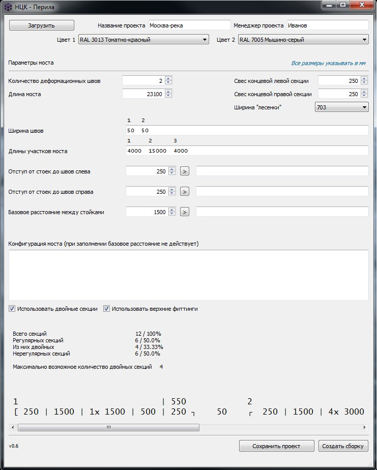

<h1 align="center">НЦК - Перила</h1>

Конфигуратор перильных ограждений из стеклопластиковых профилей для мостов

>Внимание! Программа предназначена для одной конкретной компании со своей конкретной конструкцией ограждений.
>При необходимости использования ее для себя, Вам нужно изменить ее под свою конструкцию.

### Установка
`git clone https://github.com/Woodman5/ncc_calc`

`pip install requirements.txt`

### Описание
Пользователь вводит параметры моста заказчика и получает конфигурацию ограждений.
Меняя различные параметры ограждений можно визуально оценить параметры будущего изделия, подобрать необходимые размеры.

Калькулятор управляет CAD программой Solidworks 2014 для генерации изделий и сборок на основе заранее подготовленных моделей
деталей (так проще). Также есть подготовленные скрипты управления программой Компас-2D v19 для генерации чертежей и 
технологических файлов. К сожалению они пока не включены в калькулятор и должны запускаться отдельно.

Имеется возможность сохранить данные проекта, файловая структура при этом будет создана автоматически.

### Лицензия
Этот проект лицензируется в соответствии с лицензией MIT — подробности см. в файле LICENSE.md.